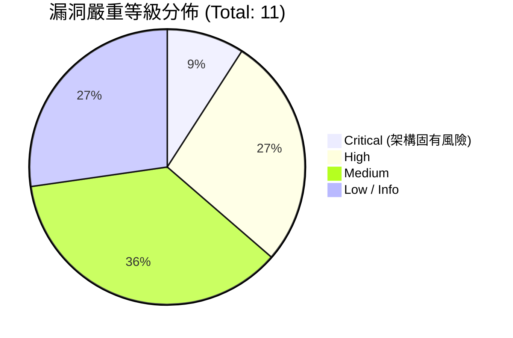
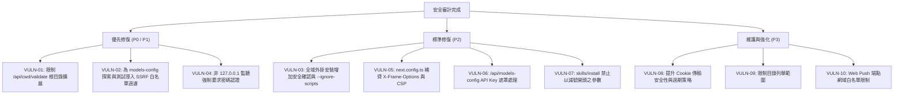

# agegr/pi-web 原始碼安全審計報告

> **審計標的**：[agegr/pi-web: Web UI for the pi coding agent](https://github.com/agegr/pi-web) (v0.9.3)  
> **專案技術棧**：Next.js 16.3.6 (Turbopack, Next Proxy), Node.js (>=22.19.0), React 19, `@earendil-works/pi-coding-agent`, `node-pty`  
> **審計日期**：2026-09-29  
> **ClickUp 專案追蹤**：List ID `901821843945` / Task ID `CU-86eyzdxt3`

---

## 1. 執行摘要 (Executive Summary)

`agegr/pi-web` 是專為 `pi` coding agent 開發的 Web 操作介面與後端服務，提供對話、模型設定、Git Worktrees、檔案瀏覽與編輯，以及基於 `node-pty` 的內建終端機功能。

本次安全審計深入分析了該專案的架構設計、認證機制、網路請求檢查、檔案系統存取控制、終端機與命令執行、外掛/技能安裝管道、模型配置與 SSRF 防護。

審計結果顯示，專案在**請求來源校驗 (`request-security.ts`)**、**符號連結路徑解析 (`path-security.ts`)**、**Markdown XSS 防護 (`rehype-sanitize`)** 以及**專案信任控制 (`project-trust.ts`)** 等方面具備良好的安全防禦意識。然而，仍發現數項**高至中度風險安全漏洞**與**架構安全缺陷**，包含根目錄存取白名單擴展逃逸、模型端點 SSRF、全域外掛安裝供應鏈風險、以及缺乏全域 Clickjacking 防護等。



---

## 2. 漏洞評級彙整清單 (Vulnerability Matrix)

| 編號 | 漏洞項目 | 影響模組 / 檔案 | 嚴重程度 | CVSS v3.1 | CWE |
| :--- | :--- | :--- | :---: | :---: | :--- |
| **VULN-01** | `/api/cwd/validate` 任意擴展根目錄導致白名單逃逸 | `app/api/cwd/validate/route.ts` | **High** | 8.2 | CWE-22, CWE-59 |
| **VULN-02** | 模型探索與測試端點 SSRF (伺服器端請求偽造) | `app/api/models-config/discover/`, `test/` | **High** | 7.5 | CWE-918 |
| **VULN-03** | 全域外掛與技能安裝繞過信任限制 (供應鏈 RCE) | `app/api/plugins/route.ts`, `skills/install/` | **High** | 7.2 | CWE-829, CWE-427 |
| **VULN-04** | 預設無認證 + LAN 暴露 + 內建 PTY 終端 (未授權 RCE) | `bin/pi-web.js`, `proxy.ts`, `app/api/terminal/` | **Critical** (架構) | 9.8 (暴露時) | CWE-306, CWE-78 |
| **VULN-05** | 缺失全域防點擊劫持標頭 (Clickjacking) | `next.config.ts`, `app/layout.tsx` | **Medium** | 6.5 | CWE-1021 |
| **VULN-06** | `GET /api/models-config` 明文輸出自訂 Provider API Key | `app/api/models-config/route.ts` | **Medium** | 6.5 | CWE-312, CWE-200 |
| **VULN-07** | `/api/skills/install` CLI 參數注入潛在風險 | `app/api/skills/install/route.ts` | **Medium** | 5.3 | CWE-88 |
| **VULN-08** | HTTP 環境下 Session Cookie 缺乏 Secure 旗標 | `lib/web-auth.ts`, `app/api/web-auth/route.ts` | **Medium** | 4.8 | CWE-614 |
| **VULN-09** | `/api/cwd/browse` 無邊界限制列舉磁碟目錄結構 | `app/api/cwd/browse/route.ts` | **Low** | 5.3 | CWE-538 |
| **VULN-10** | Web Push Webhook 端點盲打 SSRF 風險 | `app/api/push/subscribe/route.ts` | **Low** | 4.3 | CWE-918 |
| **VULN-11** | 部分 API Route Handler 缺少縱深防禦請求校驗 | `app/api/models-config/discover/route.ts` 等 | **Low** | 3.7 | CWE-693 |

---

## 3. 詳細漏洞分析與驗證 (Detailed Findings)

### VULN-01: `/api/cwd/validate` 任意擴展根目錄導致白名單逃逸 (High)

- **位置**：`app/api/cwd/validate/route.ts` (第 38 行)
- **問題分析**：
  專案在 `app/api/files/[...path]/route.ts` 中設計了嚴格的檔案白名單機制（`isFilePathAllowed` 與 `isExistingFilePathAllowed`），僅允許讀寫 `allowedRoots` 內的檔案。
  然而在 `POST /api/cwd/validate` 中：
  ```typescript
  const normalizedCwd = normalizeCwd(cwd);
  let stat: Stats;
  try {
    stat = statSync(normalizedCwd);
  } catch { ... }
  if (!stat.isDirectory()) { ... }

  allowFileRoot(normalizedCwd); // <-- 關鍵問題：未經限制地將任意目錄加入白名單
  ```
  當呼叫端傳入 `{"cwd": "/"}`（Linux/macOS）或 `{"cwd": "C:\\"}`（Windows）、甚至 `{"cwd": "~"}` 時，伺服器直接將系統磁碟根目錄加入 `__piAdditionalAllowedRoots`。
  一旦根目錄被加入，整個伺服器檔案系統的白名單防禦瞬間失效，攻擊者可藉由 `GET /api/files/[...path]?type=read` 任意下載 `/etc/passwd`、`~/.ssh/id_rsa`、`~/.pi/agent/auth.json`（存有各家 LLM API Key）、Windows 敏感組態等。

- **修復建議**：
  1. 限制 `validate` 僅能將已存在專案或明確受允許的目錄（例如使用者家目錄下的特定專案子目錄、或既有 session 的目錄）加入可讀清單。
  2. 明確禁止將檔案系統根目錄（`/`、`C:\`）、系統目錄（`/etc`, `/var`, `C:\Windows`）或使用者主目錄頂層（`~`）作為白名單根節點。

---

### VULN-02: 模型探索與測試端點 SSRF (伺服器端請求偽造) (High)

- **位置**：
  - `app/api/models-config/discover/route.ts` (第 58 行)
  - `app/api/models-config/test/route.ts` (第 80 行)
- **問題分析**：
  在 `POST /api/models-config/discover` 中，客戶端可以自訂 `provider.baseUrl`。伺服器直接對拼接後的 URL 執行 HTTP 請求：
  ```typescript
  endpoint = buildModelsListUrl(baseUrl, api);
  const response = await fetch(endpoint, {
    cache: "no-store",
    headers: buildHeaders(api, auth.apiKey, auth.headers),
    signal: AbortSignal.timeout(DISCOVERY_TIMEOUT_MS),
  });
  const responseText = await response.text();
  if (!response.ok) {
    return NextResponse.json({
      error: responseText.slice(0, 500) || `Upstream returned HTTP ${response.status}`,
      status: response.status,
    }, { status: 502 });
  }
  ```
  在 `POST /api/models-config/test` 中亦同，伺服器藉由 `completeSimple()` 向傳入的自訂 `baseURL` 送出 LLM 補全請求，並截取回傳文字 `responseText.slice(0, 300)`。

  **攻擊影響**：
  1. **雲端元數據攻擊 (Cloud Metadata)**：若 pi-web 運行於 AWS、GCP 或 Azure，攻擊者可指定 `baseUrl: "http://169.254.169.254/latest/meta-data/"`，藉由錯誤或回應提取雲端 instance 憑證及 IAM Token。
  2. **內網刺探與橫向移動 (Intranet Scanning)**：探測 127.0.0.1、10.0.0.0/8、192.168.0.0/16 之內部未授權服務（如 Redis、Elasticsearch、Kubelet、內部微服務）。

- **修復建議**：
  1. 引入 SSRF 防護模組，對 `baseUrl` 進行解析，禁止解析為私有 IP（RFC 1918）、Loopback IP (`127.0.0.1`, `::1`) 以及 Link-local 地址 (`169.254.169.254`)。
  2. 若必須支援本機 Ollama / LocalAI 模型（`http://localhost:11434`），應在 UI 或設定檔中提供顯式的「允許存取本地模型」開關，並限制僅能存取特定白名單埠號。

---

### VULN-03: 全域外掛與技能安裝繞過信任限制 (供應鏈 RCE) (High)

- **位置**：
  - `app/api/plugins/route.ts` (第 349-366 行)
  - `app/api/skills/install/route.ts` (第 25-47 行)
- **問題分析**：
  pi-web 設計了 `ProjectTrust` 機制來保護開啟未信任 Repo 時不自動執行其 `.pi/extensions`。
  然而在安裝 API 中，信任檢查**僅限定在 `scope === "project"`**：
  ```typescript
  // app/api/plugins/route.ts
  const scope = readScope(body.scope);
  if (scope === "project" && !projectTrust.trusted) {
    return NextResponse.json({ error: "Project resources must be trusted..." }, { status: 403 });
  }
  // 若 scope !== "project"，直接落入 global 安裝：
  if (body.action === "install") {
    await packageManager.installAndPersist(source, { local }); // local = false，執行 npm install
  }
  ```
  在 Node.js 中，`npm install <package>` 會觸發套件的生命週期腳本（`preinstall`, `install`, `postinstall`）。若安裝惡意 npm 套件或 Git 儲存庫，惡意腳本將立即在宿主系統執行。
  同理，`POST /api/skills/install` 在 `scope: "global"` 下也直接執行 `npx skills add <pkg> -g -y`，無任何二次確認或信任確認。

- **修復建議**：
  1. 全域外掛與技能安裝應具備額外的保護或顯式授權確認。
  2. 對外掛來源名稱進行格式校驗（僅允許合法的 npm package 名稱或經過核准的技能清單）。
  3. 安裝時加入 `--ignore-scripts` 旗標以防止 `postinstall` 執行任意系統命令。

---

### VULN-04: 預設無認證 + LAN 暴露 + 內建 PTY 終端 (Critical / 架構固有風險)

- **位置**：`bin/pi-web.js`, `proxy.ts`, `app/api/terminal/`
- **問題分析**：
  1. `PI_WEB_PASSWORD` 預設為未啟用。
  2. `npm run start:lan` / `dev:lan` 預設監聽 `0.0.0.0`，且 `isApiRequestHostAllowed` 允許所有 IP literal。
  3. 系統內建 `/api/terminal`，使用 `node-pty` 啟動原生 `cmd.exe` 或 `bash`，並允許任何請求透過 `POST /api/terminal/[id]` 寫入 stdin。
  
  **結論**：在預設或 LAN 模式下，任何同一區網內的未經授權使用者只要開啟瀏覽器訪問該 IP:30141，即直接取得主機系統最高使用者權限的 Web Shell。

- **修復建議**：
  1. 當監聽非 loopback 位址 (`0.0.0.0` 或局域網 IP) 時，**強制要求**設定 `PI_WEB_PASSWORD`，否則拒絕啟動服務。
  2. 啟動時若未偵測到密碼，可自動生成一組隨機一次性 Token 並輸出於終端機控制台（類似 Jupyter Notebook 的 token 機制）。

---

### VULN-05: 缺失全域防點擊劫持標頭 (Clickjacking) (Medium)

- **位置**：`next.config.ts`, `app/layout.tsx`
- **問題分析**：
  專案僅在 `/api/sessions/[id]/export`、Docx 預覽及 SVG 檔案串流中設定了 `Content-Security-Policy: frame-ancestors ...` 與 `X-Frame-Options: DENY`。
  但主應用頁面 `/` 以及登入頁面 `/login` 的 HTTP 回應中**完全沒有設定任何防 iframe 嵌套的標頭**。
  
  **攻擊情境**：
  惡意網站可以透過 `<iframe src="http://127.0.0.1:30141/">` 將本機 pi-web 介面透明疊加在釣魚按鈕上方。當本機使用者在惡意頁面點擊時，將觸發在 pi-web 上的操作（如建立工作區、執行指令、刪除工作記錄）。

- **修復建議**：
  在 `next.config.ts` 的 `headers()` 中加入全域安全性標頭：
  ```typescript
  {
    source: "/:path*",
    headers: [
      { key: "X-Frame-Options", value: "DENY" },
      { key: "Content-Security-Policy", value: "frame-ancestors 'none'" },
      { key: "X-Content-Type-Options", value: "nosniff" },
    ],
  }
  ```

---

### VULN-06: `GET /api/models-config` 明文輸出自訂 Provider API Key (Medium)

- **位置**：`app/api/models-config/route.ts` (第 8 行)
- **問題分析**：
  `GET /api/models-config` 透過 `readModelsConfig()` 讀取 `~/.pi/agent/models.json` 並完整原樣回傳給前端。
  若使用者於 `models.json` 配置了自訂 OpenAI 相容服務、Azure OpenAI 或自架端點，並在其中記錄了 `apiKey` 或自訂 Header（如 `Authorization: Bearer <token>`），此 API 將其以明文暴露於 HTTP 回應。

- **修復建議**：
  在回傳 `models.json` 給前端前，對所有 provider 的 `apiKey` 與授權標頭進行遮罩處理（例如只保留前 4 碼與後 4 碼：`sk-ab****12`），若前端更新未改動金鑰，後端保持原金鑰不變。

---

### VULN-07: `/api/skills/install` CLI 參數注入潛在風險 (Medium)

- **位置**：`app/api/skills/install/route.ts` (第 39 行)
- **問題分析**：
  ```typescript
  const args = ["skills", "add", pkg.trim(), "-y", "--agent", "pi"];
  if (isGlobal) args.push("-g");
  ```
  `pkg.trim()` 直接置於 `args` 陣列中。雖然使用 `execFile` 不會遭受 shell 字元注入，但未防止以 `-` 或 `--` 開頭的字串。攻擊者若傳入如 `--registry=http://malicious-npm.org` 或 CLI 特定旗標，可能被 `skills` CLI 解釋為參數而非 package 名稱。

- **修復建議**：
  驗證 `pkg` 名稱格式，嚴格禁止以 `-` 開頭，並使用正則表達式檢驗套件名稱合法性（例如 `^[a-zA-Z0-9@/._-]+$` 且不得以 `-` 開頭）。

---

### VULN-08: HTTP 環境下 Session Cookie 缺乏 Secure 旗標 (Medium)

- **位置**：`app/api/web-auth/route.ts` (第 45, 102 行)
- **問題分析**：
  `secure: isSecureRequest(request)`
  pi-web 預設以 HTTP 協定運作於連接埠 30141。在 HTTP 連線下，`secure` 屬性為 `false`。
  Cookie 屬性為 `SameSite: "lax"` 且有效期長達 30 天。若在非加密局域網環境下傳輸，此長效 Token 易遭區域網路封包監聽竊取。

- **修復建議**：
  1. 文檔與警告中強化使用 HTTPS 反向代理（如 Caddy / Nginx）的重要性。
  2. 提供可配置的 Session 過期時間與閒置自動登出機制。

---

### VULN-09: `/api/cwd/browse` 無邊界限制列舉磁碟目錄結構 (Low)

- **位置**：`app/api/cwd/browse/route.ts` (第 13-50 行)
- **問題分析**：
  API 提供檔案總管式的資料夾導覽，允許查詢任意目錄底下的子資料夾名稱（包括系統磁碟機根目錄、`/etc` 等）。攻擊者可藉此收集伺服器系統架構與已安裝軟體路徑資訊。

- **修復建議**：
  將可瀏覽範圍限制在當前使用者家目錄 (`homedir()`) 或既有專案範圍內，或提供限制根目錄之設定選項。

---

### VULN-10: Web Push Webhook 端點盲打 SSRF 風險 (Low)

- **位置**：`app/api/push/subscribe/route.ts` (第 12 行)
- **問題分析**：
  僅檢查 `endpoint` 是否為 `https://`，未檢驗是否為公網知名 Push 服務供應商（如 Google FCM、Apple APNs、Mozilla Push Service）。攻擊者若註冊內部 HTTPS 位址，伺服器將在 Session 結束時對該內部端點發送通知 POST 請求。

- **修復建議**：
  限制 Web Push endpoint 必須屬於主流瀏覽器推播網域白名單（例如 `*.googleapis.com`, `*.push.apple.com`, `*.notify.windows.com`, `updates.push.services.mozilla.com` 等）。

---

### VULN-11: 部分 API Route Handler 缺少縱深防禦請求校驗 (Low)

- **位置**：`app/api/models-config/discover/route.ts`, `app/api/push/subscribe/route.ts`, `app/api/sessions/[id]/route.ts`
- **問題分析**：
  `proxy.ts` 雖集中進行了 Host 與 Origin 校驗，但部分 Route Handler 內部缺少一致性的二次檢查（`isApiRequestAllowed` / `hasJsonContentType`），若日後路由變更或 proxy matcher 例外排除，該等端點將立即失去縱深防禦。

- **修復建議**：
  建立統一把關中介函式，確保所有 API 端點一致套用安全性檢查。

---

## 4. 防護亮點與優良安全實踐 (Security Strengths)

在本次代碼審計中，亦發現 `agegr/pi-web` 具備多項高水準的安全防禦實作：

1. **嚴格的連線安全性與來源驗證 (`lib/request-security.ts`)**
   - 透過 `isApiRequestHostAllowed` 阻絕 DNS Rebinding 攻擊，僅信任本地回環主機名稱、IP 文字與明訂之主機。
   - 嚴格校驗 `Sec-Fetch-Site` 與 `Origin`，有效阻絕絕大多數來自外部網站的跨站請求。
2. **符號連結雙向解析與比對 (`lib/path-security.ts`)**
   - 透過 `fs.realpathSync` 雙向解析真實路徑，避免傳統藉由專案內軟連結逃逸讀取系統機密檔案的攻擊手法。
3. **無 Shell 執行的子行程調用 (`child_process.execFile`)**
   - Git、NPX 及系統工具調用均採用 `execFile` 並傳遞結構化陣列參數，完全不使用 `shell: true`，杜絕傳統的 Shell Metacharacter 命令注入。
4. **Markdown 渲染多層防護 (`lib/markdown.ts`)**
   - 整合 `rehype-raw` 與 `rehype-sanitize`，明確剔除 `iframe`, `object`, `style`, `form` 等危險標籤。
   - Mermaid 圖表強制使用 `securityLevel: "strict"`，防範惡意圖表語法執行 XSS。
5. **專案信任邊界 (`lib/project-trust.ts`)**
   - 針對未受信任的程式碼儲存庫，在使用者明確授權前，拒絕載入與執行專案內的 `.pi/extensions` 與外掛腳本。

---

## 5. 總結與修復路線圖 (Remediation Roadmap)


